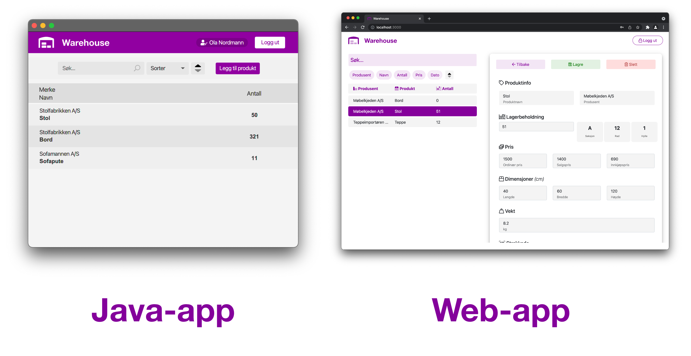

 

# IT1901 Prosjekt - Warehouse

Prosjektrepo for IT1901 - group 38.  
Dokumentasjon ligger i mappen [docs](/docs) og i undermapper for hver utgivelse av appen.  
Java-prosjektet ligger i [warehouse](/warehouse)-mappen, og en readme finnes også [der](/warehouse/README.md).  
Web-prosjektet ligger i [webapp](/webapp)-mappen, og den har også en [readme](/webapp/README.md).

## Java-klient

Java-programmet vårt lar deg se status på varer på et varelager, og (dersom man er innlogget) redigere varene og slette/legge til varer.  
Man kan lage et varelager lokalt, eller koble til en tjener.

## Nett-klient

Nettsiden vår lar deg koble til et eksisterende varelager (på en tjener), og krever alltid at man logger inn (med en eksisterende bruker). Vi har tenkt at nettsiden skal være tilgjengelig fra hvor som helst i verden, og at det derfor gir mening å kreve autentisering for å koble til et lager.  
Når man er logget inn, lar nettsiden deg se, redigere og slette varer på lageret.

